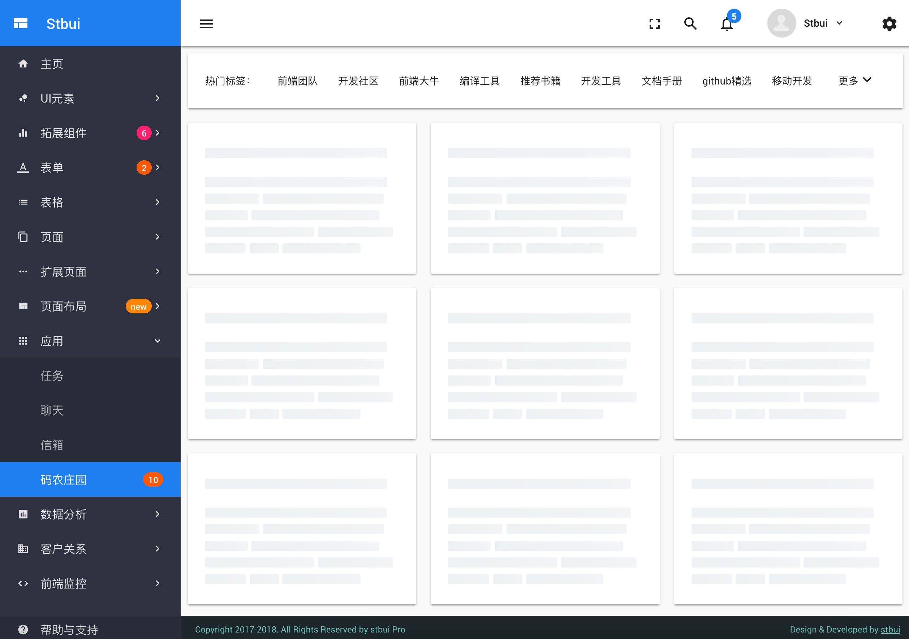

# 中后台前端应用框架 [](http://stbui.oss-cn-beijing.aliyuncs.com/angular-material-app/index.html) [](https://surgeon-canary-67612.netlify.com/) [](https://stbui.github.io/angular-material-app/) [](https://translator-rhinoceros-87537.netlify.com/)

<p align="center">
  <a href="./" target="blank"></a>
</p>

基于最新`Angular 9`框架与`Material 2`技术的企业级中后台前端应用框架。

[](https://travis-ci.org/stbui/angular-material-app)
[](https://hub.docker.com/r/stbui/angular-material-app/)
[](https://david-dm.org/stbui/angular-material-app)
[](https://david-dm.org/stbui/angular-material-app?type=dev)
[](https://gitter.im/angular-material-app/Lobby?utm_source=share-link&utm_medium=link&utm_campaign=share-link)
[](https://github.com/stbui/angular-material-app)

### Plaform

[](https://github.com/angular/angular)
[](https://github.com/angular/angular-cli)
[](https://github.com/angular/material2)
[](https://github.com/angular/flex-layout)
[](https://github.com/angular/angularfire)
[](https://github.com/angular/angular-cli)
[](https://github.com/electron/electron)
[](https://github.com/electron/electron)

### Feature

- 基于 Material Design 精心设计
- 多种颜色方案，有多个预定义的配色方案
- Flex Layout 强大的布局，并支持响应式设计
- 组件丰富，提炼后台应用的典型页面和场景
- 模块代码，添加和删除非常轻松
- 渐进式应用(PWA)，更接近原生应用体验
- 使用 graphql 精确的定义所需要的数据
- 支持 docker 构建镜像，急速部署，轻松使用
- 支持 electron 构建桌面应用
- 接入 firebase， 构建应用提供良好的用户体验
- 不定期更新，使用前端前沿技术开发新功能




### Get Start

```
git clone --depth=1 https://github.com/stbui/angular-material-app.git

cd angular-material-app

npm install
npm run start
```

打开你的浏览器，访问

```
http://127.0.0.1:4200
```

### Pubilsh

```
npm run build
```
