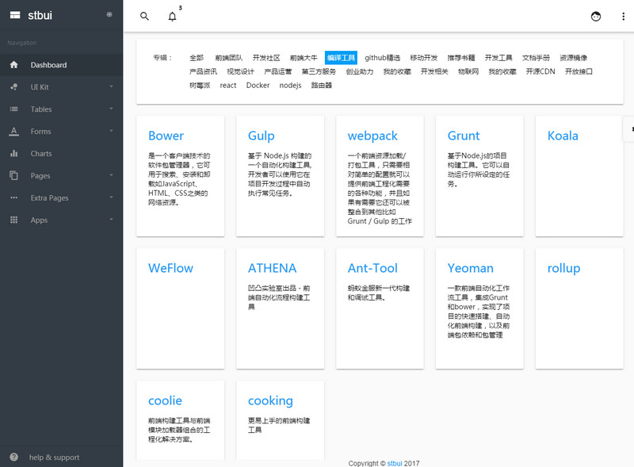

# angular2-material2-admin-app

基于`Angular 2`框架与`Material2`设计开发一套面向后台通用模板库

[](https://travis-ci.org/stbui/angular2-material2-bootstrap4-admin-app)
[](https://hub.docker.com/r/stbui/angular2-material2-admin-app/)
[](https://david-dm.org/stbui/angular2-material2-bootstrap4-admin-app)
[](https://david-dm.org/stbui/angular2-material2-bootstrap4-admin-app?type=dev)
[](http://www.stbui.com)
[](https://gitter.im/angular2-material2-bootstrap4-admin-app/Lobby?utm_source=share-link&utm_medium=link&utm_campaign=share-link)
[](https://saucelabs.com/u/angular2-ci)

### 平台环境

[](https://github.com/angular/angular)
[](https://github.com/angular/angular-cli)
[](https://github.com/angular/material2)
[](https://github.com/angular/flex-layout)


### 基本功能
- 谷歌 Material 设计
- 响应式设计
- 内置3套主题，供自由切换
- 多种颜色方案，有18个预定义的方案
- Flex Layout 强大的布局设置
- 1500+ 图标, 包括 900+ 官方 material design 图标
- Sass/Scss CSS, 很容易通过改变一些变量的更新
- 模块代码，添加和删除非常轻松
- Webpack 2 构建项目
- 通过 NPM 管理包
- 跨浏览器支持
- 免费更新


### 技术栈

[](https://github.com/angular/angular)
[](https://github.com/angular/material2)
[](https://github.com/sass/sass)
[](https://github.com/Microsoft/TypeScript)
[](https://github.com/Reactive-Extensions/RxJS)
[](https://github.com/twbs/bootstrap)




### 使用入门

```
npm i -g @angular/cli
git clone https://github.com/stbui/angular2-material2-bootstrap4-admin-app.git
```


进入项目目录
```
npm install
npm run start
```
打开你的浏览器，访问
```
http://127.0.0.1:4200
```

### 发布

```
ng build --prod --aot --env=prod
```

### Docker

快速部署

```
docker pull stbui/angular2-material2-admin-app
docker run -d -P stbui/angular2-material2-admin-app
```
或
```
docker run --rm --name angular2-material2-admin-app -v "$PWD":/usr/src/app -w /usr/src/app -p 4200:4200 -it node:latest bash -c "npm install && npm start"
```

### 开发计划

- [x] 分页
- [x] MarkDown
- [x] 高德地图
- [x] echarts
- [ ] 集成 七牛云
- [ ] 集成 阿里云
- [ ] ckeditor
- [ ] highcharts


### 开源许可证

