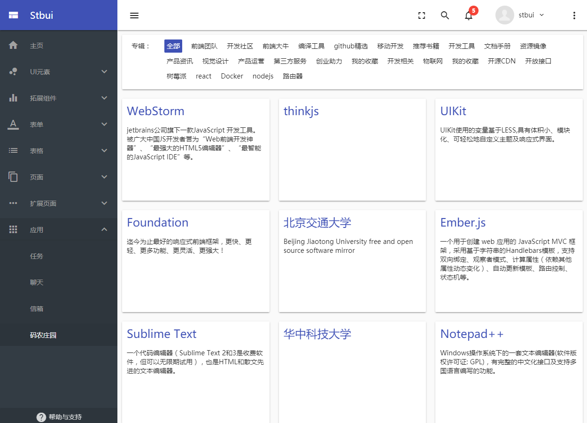

# 中后台前端应用框架 [](http://stbui.oss-cn-beijing.aliyuncs.com/angular-material-app/index.html)  [](https://surgeon-canary-67612.netlify.com/)  [](https://stbui.github.io/angular-material-app/) [](https://translator-rhinoceros-87537.netlify.com/)

<p align="center">
  <a href="./" target="blank"></a>
</p>

基于最新`Angular 6`框架与`Material 2`技术的企业级中后台前端应用框架，涵盖了大量的常用组件和基础功能，您可以快速开发各种MIS系统，如CMS、OA、CRM、ERP、POS等，最大程度上帮助企业节省时间成本和费用开支。

[](https://travis-ci.org/stbui/angular-material-app)
[](https://hub.docker.com/r/stbui/angular-material-app/)
[](https://david-dm.org/stbui/angular-material-app)
[](https://david-dm.org/stbui/angular-material-app?type=dev)
[](https://gitter.im/angular-material-app/Lobby?utm_source=share-link&utm_medium=link&utm_campaign=share-link)
[](https://github.com/stbui/angular-material-app)


### Plaform 

[](https://github.com/angular/angular)
[](https://github.com/angular/angular-cli)
[](https://github.com/angular/material2)
[](https://github.com/angular/flex-layout)
[](https://github.com/angular/angularfire2)


### Feature

- 基于 Material Design 精心设计
- 多种颜色方案，有多个预定义的配色方案
- Flex Layout 强大的布局，并支持响应式设计
- 组件丰富，提炼后台应用的典型页面和场景
- 模块代码，添加和删除非常轻松
- 渐进式应用(PWA)，更接近原生应用体验
- 支持 docker 构建镜像， 急速部署，轻松使用
- 支持 electron 构建桌面应用
- 接入 firebase， 构建应用提供良好的用户体验
- 不定期更新，使用前端前沿技术开发新功能




### Get Start

```
git clone --depth=1 https://github.com/stbui/angular-material-app.git
cd angular-material-app
npm install
npm run start
```

打开你的浏览器，访问
```
http://127.0.0.1:4200
```

### Pubilsh

```
npm run build
```


### Integration
##### Docker

* [docs](docs/docker.md)

##### Electron

* [docs](docs/electron.md)

##### Firebase

* [docs](docs/firebase.md)

##### PWA

* [docs](docs/pwa.md)

##### Universal

* [docs](docs/universal.md)

# Contrubuting

我们非常欢迎你的贡献，你可以通过以下方式和我们一起贡献：
* 在你的公司或个人项目中使用项目。
* 通过 [Issue](https://github.com/stbui/angular-material-app/issues) 报告 bug 或进行咨询。
* 提交 [Pull Request](https://github.com/stbui/angular-material-app/pulls) 来改进。

